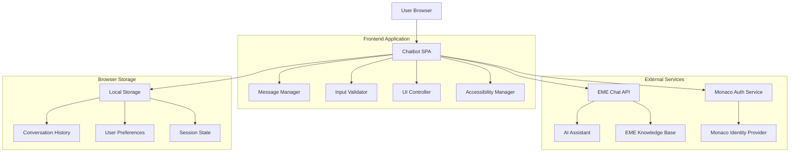

# Design Document

## Overview

The EME Monaco Chatbot is a sophisticated single-page web application that serves as an intelligent digital concierge for Extended Monaco Entreprises services. The design emphasizes government authority, user trust, and accessibility while providing a modern conversational interface that seamlessly integrates with Monaco's official digital identity.

The application follows a mobile-first, progressive enhancement approach with a clean, professional aesthetic that reflects the prestige and reliability expected from Monaco's government services. The interface prioritizes clarity, accessibility, and user confidence through transparent AI disclosure and robust error handling.

## Architecture

### System Architecture



### Component Architecture

The application follows a modular component architecture with clear separation of concerns:

- **Presentation Layer**: UI components with EME visual identity
- **Business Logic Layer**: Message handling, validation, and state management
- **Data Layer**: LocalStorage persistence and API communication
- **Security Layer**: Input sanitization and XSS protection
- **Accessibility Layer**: ARIA implementation and keyboard navigation

### Technology Stack

- **Frontend Framework**: Vanilla TypeScript with modern ES modules
- **Styling**: CSS Custom Properties with EME design tokens
- **Build Tool**: Vite for fast development and optimized production builds
- **Security**: DOMPurify for content sanitization
- **Markdown**: Marked.js for rich text rendering
- **Testing**: Vitest for unit tests, Playwright for E2E testing
- **Accessibility**: axe-core for automated accessibility testing

## Components and Interfaces

### Core Components

#### 1. ChatbotContainer
The main application container that orchestrates all other components.

```typescript
interface ChatbotContainer {
  // State management
  messages: ChatMessage[];
  isLoading: boolean;
  currentInput: string;
  
  // Methods
  initialize(): void;
  loadPersistedState(): void;
  handleResize(): void;
}
```

#### 2. MessageContainer
Displays the conversation history with auto-scrolling and accessibility features.

```typescript
interface MessageContainer {
  // Properties
  messages: ChatMessage[];
  autoScroll: boolean;
  isUserScrolling: boolean;
  
  // Methods
  renderMessage(message: ChatMessage): HTMLElement;
  scrollToBottom(smooth?: boolean): void;
  handleUserScroll(): void;
  announceToScreenReader(message: string): void;
}
```

#### 3. InputField
Handles user input with validation, character counting, and keyboard shortcuts.

```typescript
interface InputField {
  // Properties
  value: string;
  maxLength: number;
  isValid: boolean;
  characterCount: number;
  
  // Methods
  validate(input: string): ValidationResult;
  handleKeyPress(event: KeyboardEvent): void;
  autoResize(): void;
  focus(): void;
  clear(): void;
}
```

#### 4. MessageBubble
Individual message display component with role-based styling.

```typescript
interface MessageBubble {
  // Properties
  message: ChatMessage;
  role: 'user' | 'assistant' | 'system' | 'error';
  timestamp: Date;
  
  // Methods
  render(): HTMLElement;
  copyToClipboard(): void;
  formatMarkdown(content: string): string;
}
```

#### 5. TrustHeader
Government branding and AI transparency disclosure.

```typescript
interface TrustHeader {
  // Properties
  showAIDisclaimer: boolean;
  governmentBadge: GovernmentBadge;
  
  // Methods
  renderGovernmentBadge(): HTMLElement;
  showAIInfoModal(): void;
  renderContactFallback(): HTMLElement;
}
```

### Data Models

#### ChatMessage
```typescript
interface ChatMessage {
  id: string;                    // UUID v4
  timestamp: number;             // Unix timestamp
  role: 'user' | 'assistant' | 'system' | 'error';
  content: string;               // Sanitized content
  metadata?: {
    requestId?: string;
    processingTime?: number;
    confidence?: number;
    sources?: string[];
  };
}
```

#### ChatState
```typescript
interface ChatState {
  messages: ChatMessage[];
  sessionId: string;
  lastActivity: number;
  version: string;
  userPreferences: {
    theme: 'light' | 'dark' | 'high-contrast';
    fontSize: 'small' | 'medium' | 'large';
    autoScroll: boolean;
  };
}
```

#### ValidationResult
```typescript
interface ValidationResult {
  isValid: boolean;
  errors: string[];
  warnings: string[];
  characterCount: number;
  canSend: boolean;
}
```

### API Interfaces

#### Chat API Request
```typescript
interface ChatAPIRequest {
  message: string;
  sessionId: string;
  context?: {
    userType?: 'business' | 'individual' | 'government';
    previousMessages?: ChatMessage[];
    language?: 'fr' | 'en';
  };
  metadata: {
    clientVersion: string;
    timestamp: number;
    userAgent: string;
  };
}
```

#### Chat API Response
```typescript
interface ChatAPIResponse {
  response: string;
  confidence: number;
  sources?: string[];
  suggestedActions?: string[];
  requestId: string;
  processingTime: number;
  metadata: {
    model: string;
    version: string;
    timestamp: number;
  };
}
```

## Data Models

### Message Storage Schema

Messages are stored in localStorage with the following structure:

```typescript
// LocalStorage key: 'eme-chatbot-session'
interface StoredChatData {
  version: '1.0';
  sessionId: string;
  created: number;
  lastModified: number;
  messages: ChatMessage[];
  userPreferences: UserPreferences;
  metadata: {
    totalMessages: number;
    totalCharacters: number;
    averageResponseTime: number;
  };
}
```

### User Preferences Schema

```typescript
interface UserPreferences {
  theme: 'light' | 'dark' | 'high-contrast';
  fontSize: 'small' | 'medium' | 'large';
  autoScroll: boolean;
  soundEnabled: boolean;
  animationsEnabled: boolean;
  language: 'fr' | 'en';
  accessibilityMode: boolean;
}
```

### Error Handling Schema

```typescript
interface ErrorState {
  type: 'network' | 'timeout' | 'server' | 'validation' | 'storage';
  message: string;
  code?: string;
  timestamp: number;
  retryable: boolean;
  originalRequest?: ChatAPIRequest;
}
```

## Correctness Properties

*A property is a characteristic or behavior that should hold true across all valid executions of a system—essentially, a formal statement about what the system should do. Properties serve as the bridge between human-readable specifications and machine-verifiable correctness guarantees.*

### Property Reflection

After analyzing all acceptance criteria, I identified several areas where properties can be consolidated to eliminate redundancy:

- **Input validation properties** (1.1, 1.2) can be combined into a comprehensive input validation property
- **Message persistence properties** (3.1, 3.2, 3.4) can be consolidated into a single round-trip persistence property
- **Error handling properties** (4.1, 4.2, 4.4) share common error display patterns
- **Accessibility properties** (5.1, 5.2, 5.4) can be grouped by ARIA compliance
- **Responsive design properties** (6.1, 6.2, 6.3) follow the same responsive behavior pattern
- **Security properties** (7.1, 7.2, 7.4, 7.5) all relate to content sanitization

### Core Correctness Properties

Property 1: Input validation and character limits
*For any* text input, the system should accept inputs up to 4000 characters and reject inputs exceeding this limit, while disabling send functionality for empty or whitespace-only inputs
**Validates: Requirements 1.1, 1.2**

Property 2: Character counter visual feedback
*For any* input with character count, the counter should display orange color at 3500+ characters and red color at 3800+ characters
**Validates: Requirements 1.3**

Property 3: Keyboard interaction consistency
*For any* valid input, pressing Enter should send the message, while Shift+Enter should create a new line
**Validates: Requirements 1.4, 1.5**

Property 4: Input field state management
*For any* successful message send, the input field should be cleared and refocused for the next message
**Validates: Requirements 1.6**

Property 5: Optimistic UI updates
*For any* user message, it should immediately appear in the conversation before the API response
**Validates: Requirements 2.1**

Property 6: Loading state consistency
*For any* pending API request, a typing indicator should be displayed in the message container
**Validates: Requirements 2.2**

Property 7: Auto-scroll behavior
*For any* new message added to the conversation, the message container should automatically scroll to the bottom
**Validates: Requirements 2.3**

Property 8: Message display completeness
*For any* displayed message, it should include a timestamp and proper role-based styling (user vs assistant)
**Validates: Requirements 2.4**

Property 9: Conversation persistence round-trip
*For any* conversation state, saving to localStorage and then reloading should restore the identical conversation with all message metadata
**Validates: Requirements 3.1, 3.2, 3.4**

Property 10: Data clearing completeness
*For any* clear chat action, all localStorage data should be removed and the UI should reset to initial state
**Validates: Requirements 3.3**

Property 11: Data migration reliability
*For any* existing localStorage data, the system should validate format and migrate to current version if necessary
**Validates: Requirements 3.5**

Property 12: Error handling consistency
*For any* network error (timeout, connection failure, server error), a user-friendly error message should appear as a system chat bubble
**Validates: Requirements 4.1, 4.2, 4.4**

Property 13: Input retention on failure
*For any* failed message send, the original user input should be retained in the input field
**Validates: Requirements 4.3**

Property 14: Error logging separation
*For any* error occurrence, technical details should be logged while users see only friendly messages
**Validates: Requirements 4.5**

Property 15: Screen reader announcements
*For any* new message, it should be announced to screen readers via aria-live regions
**Validates: Requirements 5.1**

Property 16: Keyboard navigation accessibility
*For any* interactive element, it should have visible focus indicators when navigated with keyboard
**Validates: Requirements 5.2**

Property 17: Color contrast compliance
*For any* text element, it should maintain a minimum contrast ratio of 4.5:1 against its background
**Validates: Requirements 5.3**

Property 18: ARIA labeling completeness
*For any* interactive control, it should include descriptive aria-label attributes
**Validates: Requirements 5.4**

Property 19: Responsive layout adaptation
*For any* screen width, the interface should adapt appropriately (mobile: 320-768px, tablet: 768-1024px, desktop: 1024px+)
**Validates: Requirements 6.1, 6.2, 6.3**

Property 20: Touch target accessibility
*For any* interactive element on touch devices, it should have a minimum size of 44px
**Validates: Requirements 6.4**

Property 21: Content sanitization security
*For any* user input or system output, it should be sanitized to prevent XSS attacks before rendering
**Validates: Requirements 7.1, 7.2**

Property 22: Data validation integrity
*For any* data stored locally, it should be validated for integrity and format compliance
**Validates: Requirements 7.3**

Property 23: URL and link security
*For any* URL or link content, it should be validated and sanitized before display
**Validates: Requirements 7.4**

Property 24: Markdown security parsing
*For any* markdown content, it should be parsed with XSS protection enabled
**Validates: Requirements 7.5**

Property 25: AI response labeling
*For any* AI-generated response, it should include appropriate disclaimers about its AI nature
**Validates: Requirements 8.3**

Property 26: Design system consistency
*For any* UI component, it should use official EME design system colors and typography
**Validates: Requirements 9.3**

Property 27: Monaco accent color usage
*For any* interactive element, it should use Monaco red (#CE1126) as the primary accent color
**Validates: Requirements 9.5**

Property 28: Performance timing requirements
*For any* page load, First Contentful Paint should occur within 1.5 seconds, and user interactions should provide feedback within 100ms
**Validates: Requirements 10.1, 10.2**

Property 29: Resource optimization compliance
*For any* loaded resource, it should meet optimization requirements for fast delivery
**Validates: Requirements 10.4**

Property 30: Core Web Vitals compliance
*For any* application execution, Core Web Vitals scores should remain in the "Good" range
**Validates: Requirements 10.5**

Property 31: Markdown rendering completeness
*For any* AI response with markdown, it should render bold, italic, lists, and links correctly
**Validates: Requirements 11.1**

Property 32: Copy functionality availability
*For any* AI response, it should include a functional copy-to-clipboard button
**Validates: Requirements 11.2**

Property 33: Theme switching functionality
*For any* theme preference change, the interface should switch between light, dark, and high-contrast modes correctly
**Validates: Requirements 11.3**

Property 34: Input field expansion behavior
*For any* long text input, the input field should expand vertically up to a maximum height of 120px
**Validates: Requirements 11.4**

Property 35: Conversation export functionality
*For any* conversation, the export feature should produce a valid formatted download
**Validates: Requirements 11.5**

## Error Handling

### Error Classification and Response Strategy

The chatbot implements a comprehensive error handling system that categorizes errors and provides appropriate user feedback while maintaining system stability.

#### Error Categories

1. **Input Validation Errors**
   - Character limit exceeded
   - Empty or whitespace-only input
   - Invalid characters or formatting
   - Response: Immediate visual feedback, disable send button

2. **Network Errors**
   - Connection timeout (30+ seconds)
   - Network unavailable
   - DNS resolution failure
   - Response: Friendly error message in chat, retry option

3. **Server Errors**
   - HTTP 4xx client errors
   - HTTP 5xx server errors
   - API rate limiting
   - Response: User-friendly message, technical details logged

4. **Storage Errors**
   - LocalStorage quota exceeded
   - Data corruption
   - Migration failures
   - Response: Graceful degradation, user notification

5. **Security Errors**
   - XSS attempt detected
   - Invalid content sanitization
   - Malicious URL detection
   - Response: Silent blocking, security logging

#### Error Recovery Mechanisms

```typescript
interface ErrorRecovery {
  // Automatic retry with exponential backoff
  retryWithBackoff(request: ChatAPIRequest, attempt: number): Promise<void>;
  
  // Input preservation on failure
  preserveUserInput(input: string): void;
  
  // Graceful degradation
  fallbackToOfflineMode(): void;
  
  // User notification
  showUserFriendlyError(error: ErrorState): void;
}
```

#### Error Message Templates

- **Network Timeout**: "La demande a pris trop de temps. Veuillez réessayer."
- **Connection Error**: "Problème de connexion. Vérifiez votre réseau."
- **Server Unavailable**: "Service temporairement indisponible. Contactez le support EME."
- **Storage Full**: "Espace de stockage insuffisant. Effacez l'historique pour continuer."
- **Rate Limited**: "Trop de demandes. Attendez quelques instants avant de réessayer."

## Testing Strategy

### Dual Testing Approach

The EME Monaco Chatbot employs both unit testing and property-based testing to ensure comprehensive coverage and correctness validation.

#### Unit Testing Focus Areas

Unit tests verify specific examples, edge cases, and integration points:

- **Component Integration**: Verify proper communication between UI components
- **Edge Cases**: Test boundary conditions like character limits, empty states
- **Error Scenarios**: Validate specific error conditions and recovery paths
- **Accessibility Features**: Test screen reader compatibility and keyboard navigation
- **Browser Compatibility**: Ensure consistent behavior across supported browsers

#### Property-Based Testing Configuration

Property tests validate universal properties across randomized inputs:

- **Test Framework**: Vitest with fast-check for property-based testing
- **Minimum Iterations**: 100 runs per property test (due to randomization)
- **Test Tagging**: Each property test references its design document property
- **Tag Format**: `// Feature: eme-chatbot, Property {number}: {property_text}`

#### Testing Categories

1. **Input Validation Testing**
   - Generate random strings of various lengths
   - Test character limit enforcement
   - Validate whitespace handling
   - Verify sanitization effectiveness

2. **State Management Testing**
   - Test localStorage persistence across page reloads
   - Validate data migration scenarios
   - Verify state consistency after errors

3. **UI Interaction Testing**
   - Test keyboard shortcuts across different input states
   - Validate scroll behavior with various message counts
   - Verify responsive layout at different screen sizes

4. **Security Testing**
   - Generate XSS payloads to test sanitization
   - Validate URL and link security
   - Test markdown parser security

5. **Performance Testing**
   - Measure Core Web Vitals under various conditions
   - Test performance with long conversations
   - Validate resource loading optimization

6. **Accessibility Testing**
   - Automated testing with axe-core
   - Screen reader compatibility testing
   - Keyboard navigation validation
   - Color contrast verification

#### Test Environment Setup

```typescript
// Property test configuration
interface PropertyTestConfig {
  framework: 'vitest';
  propertyLibrary: 'fast-check';
  iterations: 100;
  timeout: 30000;
  coverage: {
    statements: 90;
    branches: 85;
    functions: 90;
    lines: 90;
  };
}

// Example property test structure
describe('EME Chatbot Properties', () => {
  test('Property 1: Input validation and character limits', () => {
    // Feature: eme-chatbot, Property 1: Input validation and character limits
    fc.assert(fc.property(
      fc.string({ minLength: 0, maxLength: 5000 }),
      (input) => {
        const result = validateInput(input);
        if (input.length <= 4000 && input.trim().length > 0) {
          expect(result.canSend).toBe(true);
        } else {
          expect(result.canSend).toBe(false);
        }
      }
    ), { numRuns: 100 });
  });
});
```

#### Manual Testing Requirements

- **Cross-browser Testing**: Chrome, Firefox, Safari, Edge
- **Device Testing**: Mobile (iOS/Android), Tablet, Desktop
- **Accessibility Testing**: Screen readers (NVDA, JAWS, VoiceOver)
- **Network Conditions**: Slow 3G, offline scenarios, intermittent connectivity
- **User Acceptance Testing**: Real user scenarios with EME stakeholders

#### Continuous Integration

- **Pre-commit Hooks**: Lint, type check, unit tests
- **Pull Request Checks**: Full test suite, accessibility audit, performance benchmarks
- **Deployment Pipeline**: E2E tests, security scans, performance validation
- **Monitoring**: Real user monitoring, error tracking, performance metrics

<function_calls>
<invoke name="prework">
<parameter name="featureName">eme-chatbot